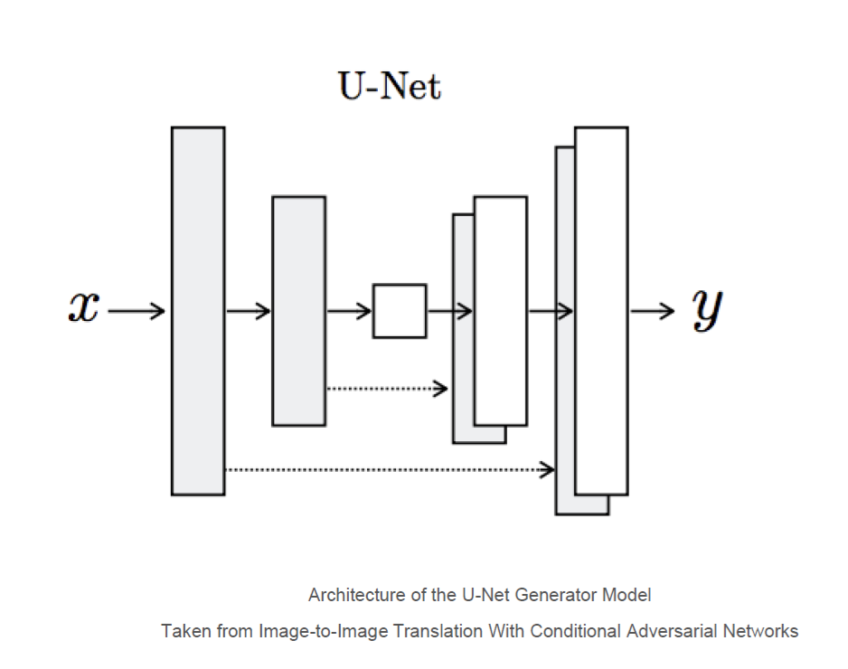

# Pix2Pix-GAN
The Pix2Pix Generative Adversarial Network, or
GAN, is an approach to training a deep
convolutional neural network for image-to-image
translation tasks like as 
● Converting maps to satellite photographs 
● Black and white photographs to color 
● Sketches of products to product photographs 

<h2>How Does it Work ?</h2>
The GAN architecture is comprised of a generator model for outputting
new plausible synthetic images, and a discriminator model that classifies
images as real (from the dataset) or fake (generated). The discriminator
model is updated directly, whereas the generator model is updated via
the discriminator model. As such, the two models are trained
simultaneously in an adversarial process where the generator seeks to
better fool the discriminator and the discriminator seeks to better
identify the counterfeit images. 

<h2>Satellite to Map Image Translation</h2>
The image translation project involves converting satellite photos to
Google maps format, or the reverse, Google maps images to Satellite
photos.
 
We will use the so-called “maps” dataset
used in the Pix2Pix paper.This is a dataset
comprised of satellite images of New York
and their corresponding Google maps
pages. Images have a digit filename and are
in JPEG format. Each image is 1,200 pixels
wide and 600 pixels tall and contains both
the satellite image on the left and the
Google maps image on the right.
you can download the dataset from here .
<a href="http://efrosgans.eecs.berkeley.edu/pix2pix/datasets/maps.tar.gz">Maps Dataset</a>
  
The Model architecture is comprised of two models: 
● Discriminator 

● Generator. 
 
Descriminator ->  
● The discriminator is a deep convolutional neural network that
performs image classification. Specifically, conditional-image
classification. It takes both the source image (e.g. satellite photo)
and the target image (e.g. Google maps image) as input and
predicts the likelihood of whether target image is real or a fake
translation of the source image. 
Generator -> 

● The generator is an encoder-decoder model using a U-Net
architecture. The model takes a source image (e.g. satellite
photo) and generates a target image (e.g. Google maps image). It
does this by first downsampling or encoding the input image
down to a bottleneck layer, then upsampling or decoding the
bottleneck representation to the size of the output image.  

The U-Net architecture
means that
skip-connections are
added between the
encoding layers and the
corresponding decoding
layers, forming a
U-shape.
The image makes the
skip-connections clear,
showing how the first
layer of the encoder is
connected to the last
layer of the decoder, and
so on.  

Training can be done on CPU
hardware, although GPU hardware
is recommended.
Here we have used Kaggle to train
our model which comes with free
GPU and TPU access .
Models are saved every 10 epochs
and saved to a file with the training
iteration number. Additionally,
images are generated every 10
epochs and compared to the
expected target images. 

We can see that the generated image captures large roads
with orange and yellow. The generated image is almost
similar to the expected image.
Now from this model is working well we can also try to work
out for the reverse.
That is, we can develop a Pix2Pix model to translate Google
map images to plausible satellite images.
Thus a Pix2Pix GAN can work well for the image to image
translation works .

